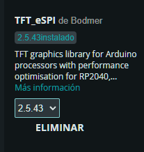

## Programacion de Maceta Inteligente 

# Requisitos previos

- Arduino IDE
- NodeMCU ESP32 V3
- Sensor DHT22
- Pantalla TFT LCD de 240x320
- Sensor de Luz
- Modulo HC-12 400mhz x 2
- Sensor de Humedas de Tierra 
- Bateria 5V 
- Cables tipo C o micro usb

# Librerias

- SPI
- TFT_eSPI
- DHT
- WIFI
- HTTPClient

## Instalacion 

En el ide de arduno debemos instalar todas las librerias
